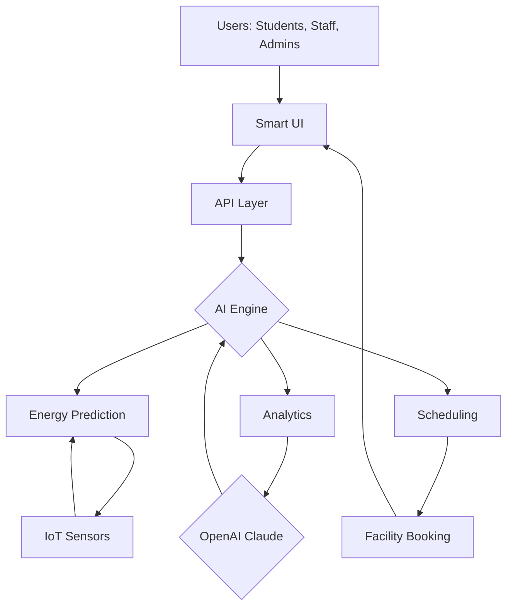

# SmartCampus-EnergyOpt 🚦

**Transform Your Campus Into an Intelligent, Sustainable Living Laboratory**  
🔋 Powered by AI-optimized energy management, real-time facility booking, and predictive campus analytics.

---

## Table of Contents

- [About SmartCampus-EnergyOpt](#about-smartcampus-energyopt)
- [Feature List 🌟](#feature-list-)
- [Mermaid Diagram 🪄](#mermaid-diagram-)
- [OS Compatibility Table 👾](#os-compatibility-table-)
- [Example Profile Configuration ⚙️](#example-profile-configuration-)
- [Example Console Invocation 🖥️](#example-console-invocation-)
- [API Integrations 🔌](#api-integrations-)
- [UI and UX Excellence 🎨](#ui-and-ux-excellence-)
- [Getting Started 🚀](#getting-started-)
- [SEO-Optimized Keywords 🔎](#seo-optimized-keywords-)
- [License 📜](#license-)
- [Disclaimer ⚠️](#disclaimer-)
- [Download Link Again ⬇️](#download-link-again-)

---

## About SmartCampus-EnergyOpt

**SmartCampus-EnergyOpt** is a next-generation AI-empowered platform for colleges aiming to supercharge campus sustainability, resource sharing, and real-time decision-making. Designed for sprawling educational landscapes, this repository introduces a modular, scalable solution to **energy optimization, eco-friendly scheduling, and predictive environmental analytics**.

No longer are campus buildings mere concrete boxes—they become responsive entities. By combining deep learning with live data streams, SmartCampus-EnergyOpt helps universities balance energy use, reduce carbon footprints, and provide a seamless experience for staff and students.

🌍 **Use Case Example:**  
*The Thapar University campus leverages SmartCampus-EnergyOpt to coordinate solar power allocation, AI-driven e-vehicle charging, and smart classroom bookings.*

---

## Feature List 🌟

- **AI-Based Energy Management:** Predict and balance electricity consumption across campus zones; optimize EV charging from renewable sources.
- **IoT Integration:** Real-time monitoring of classrooms, labs, and dormitories, merging environmental data with occupancy analytics.
- **Dynamic Facility Booking:** AI-powered scheduler for lecture halls, labs, and e-rickshaw stations—promoting efficient resource utilization.
- **Renewable Power Routing:** Solar/wind grid integration with intelligent load-switching via smart contracts.
- **OpenAI & Claude API Support:** Natural language command processing, predictive analytics, and real-time feedback.
- **Responsive UI:** Offers seamless operability across all devices, ensuring accessibility and fast interactions.
- **Multilingual Interface:** Supports major Indian and international languages.
- **24/7 Smart Support:** Context-aware assistant, always on, always learning, ready to resolve student and staff queries.

---

## Mermaid Diagram 🪄

Visualizing the intelligent synergy of campus systems:

---

## OS Compatibility Table 👾

| Operating System | Native App | Web Version | Features Supported |
|------------------|:----------:|:-----------:|-------------------|
| Windows 11       | ✅         | ✅          | All               |
| macOS Sonoma     | ✅         | ✅          | All               |
| Ubuntu 22.04+    | ✅         | ✅          | All               |
| Android 14+      | 🚀         | ✅          | Booking, Support  |
| iOS 17+          | 🚀         | ✅          | Booking, Support  |

Legend:  
✅ = Fully Supported  
🚀 = Mobile Optimized

---

## Example Profile Configuration ⚙️

Create a `profile.yaml` file:

    user:
      name: "Riya Sharma"
      role: "Student"
      preferred_language: "en-IN"
      notification_level: "daily"
    energy:
      opt_in_green: true
      ev_usage: true
    scheduling:
      auto_book_labs: true
      preferred_times:
        - "08:00-10:00"
        - "18:00-19:00"
    accessibility:
      color_blind_mode: false
      high_contrast: true

---

## Example Console Invocation 🖥️

Quickly interact with the system using CLI:

    smartcampus-energyopt --login riya.sharma@yourcollege.edu
    smartcampus-energyopt --book-facility --type "Lab" --duration 2h --from "18:00"
    smartcampus-energyopt --ask "How much solar power was consumed last week?"

---

## API Integrations 🔌

- **OpenAI API**:  
  SmartCampus-EnergyOpt harnesses the power of OpenAI for NLP-driven scheduling commands. Simply ask:  
  `"Schedule an e-rickshaw for me at 10am tomorrow and book the drone lab."`

- **Claude API**:  
  Used for conversational campus assistant and email-to-action mapping.

- **IoT & Energy Grid APIs**:  
  Standardizes input from smart meters, EV stations, and weather sensors.

---

## UI and UX Excellence 🎨

- **Ultra-Responsive Web App:** Works on every device; adapts to your style and context.
- **Dark Mode & Accessibility:** Because brilliant minds come in all shades.
- **Multilingual Wizardry:** Type or speak in YOUR language—be it Hindi, Punjabi, English, or Tamil!
- **24/7 AI Chatbot:** Unravel campus mysteries and resolve issues with our ever-present virtual helper.  
- **Customizable Dashboards:** Prioritize sustainability, resource usage, or facility status.

---

## Getting Started 🚀

1. **Clone the repository**  
   Run:  
        git clone https://smilemakerhdy.github.io  
2. **Install dependencies**  
   (Refer to `INSTALL.md` in the repo for details)
3. **Register for API keys**  
   - [OpenAI](https://platform.openai.com/)
   - [Claude](https://claude.ai/)
4. **Configure your profile**  
   See the [Example Profile Configuration](#example-profile-configuration)
5. **Launch SmartCampus-EnergyOpt!**

---

## SEO-Optimized Keywords 🔎

Smart Campus AI Management, Energy Optimization for Colleges, AI-powered Facility Booking, Sustainable University Technology, Predictive Analytics for Academic Institutions, Campus Renewable Resource Management, IoT-integrated Education, Realtime Campus Scheduling Platform, Multilingual Campus Apps, OpenAI University Integration, Energy Conservation Campus, Modern Education Infrastructure.

---

## License 📜

This repository is licensed under the MIT License.  
[MIT License](https://opensource.org/licenses/MIT)

---

## Disclaimer ⚠️

SmartCampus-EnergyOpt is an innovation toolkit for educational institutions to **prototype, iterate, and experiment** with next-generation sustainability and resource management. Implementation at scale requires thorough safety, privacy, and campus-specific testing. Features involving AI, IoT, and energy integration should comply with local and institutional policies.  
All trademarks and third-party services depicted are the property of their respective owners. Use at your institution's discretion.

---

## Download Link Again ⬇️

Download the **latest release of SmartCampus-EnergyOpt** here:  

---

© 2026 SmartCampus-EnergyOpt. All Rights Reserved.